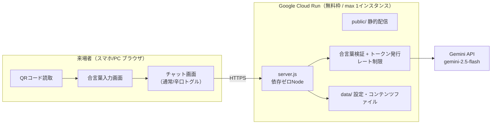

# AI社長アプリ 要件定義・設計書（イベント版）

1日限定イベントで、来場者がスマホ/PCのブラウザからQRコードで参加し、
AI社長（佐々木社長パロディ）と遊べるアプリにするための要件定義と設計。

- 作成日：2026-07-15
- 対象リポジトリ：`Hiroto08/ai_sasaki`（現行モックをベースに拡張）

---

## 1. 前提・スコープ

| 項目 | 内容 |
|---|---|
| 利用シーン | 社内イベント等での1日限定稼働（数時間〜24時間） |
| 利用者 | 最大同時接続 200名程度、イベント参加者 |
| デバイス | スマホ・PCのブラウザ（アプリインストール不要） |
| コスト方針 | 無料枠を最大活用し、実費は生成AI API利用料のみ（目標：数百円〜1,500円/日） |
| コンテンツ | 現行のエンタメ仕様（おみくじ・診断・クイズ・なんでも相談）を継続 |
| 法務前提 | 非公式パロディである旨の常時表示、実在の容姿・音声の不使用（現行方針を維持） |

---

## 2. 要件定義

### 2.1 機能要件

| ID | 要件 | 詳細 |
|---|---|---|
| FR-1 | QRコードで利用開始 | QRを読み取るとアプリURLが開く。URLだけで参加でき、事前登録・ログイン不要 |
| FR-2 | 合言葉による入場制限 | 初回アクセス時に合言葉入力画面を表示。正解しないとチャット画面に進めない。合言葉は環境変数で設定・変更可能 |
| FR-3 | AI社長チャット | 現行のエンタメチャット（おみくじ・診断・クイズ・雑談）。Gemini APIで応答生成 |
| FR-4 | 辛口モードトグル | チャット画面のトグルスイッチで「通常モード⇔辛口モード」を切替。切替に応じてシステムプロンプトに注入する口調・口癖定義が切り替わる |
| FR-5 | コンテンツの手動更新 | ペルソナ・口癖・エンタメコンテンツを、コードを触らずファイル編集だけで更新できる（再デプロイ or 再起動で反映。ローカルは保存即反映） |
| FR-6 | アバター表示 | 現行仕様を維持（イラスト、許諾後はPNG差し込み） |
| FR-7 | 利用制限 | 1人あたりの発話回数上限・連投制限（コスト暴走と占有の防止） |

### 2.2 非機能要件

| ID | 要件 | 目標値 |
|---|---|---|
| NFR-1 | 同時接続 | 200クライアント（チャットはI/OバウンドのためNode 1インスタンスで十分） |
| NFR-2 | 応答速度 | AI応答開始まで3〜5秒以内（gemini-2.5-flash想定） |
| NFR-3 | コスト | ホスティング0円（無料枠内）+ AI API 実費のみ |
| NFR-4 | 稼働期間 | イベント当日のみ。終了後はサービス停止（URL無効化） |
| NFR-5 | セキュリティ | 合言葉必須、APIキーはサーバー側のみ保持、レート制限、HTTPS |
| NFR-6 | 運用性 | 非エンジニアでも合言葉変更・コンテンツ差し替えの手順書で運用可能 |

---

## 3. システム構成

### 3.1 アーキテクチャ



### 3.2 ホスティング選定（無料枠比較）

| 候補 | 無料枠 | 200同時 | 評価 |
|---|---|---|---|
| **Google Cloud Run（推奨）** | 月200万リクエスト・18万vCPU秒など。1日イベントなら余裕で0円 | ◎（1インスタンスで十分、`max-instances=1`でコスト上限も固定） | ◎ Gemini と同じGoogleで管理が一元化 |
| Render Free | 750時間/月だが**15分でスリープ→コールドスタート約1分** | △ | イベント中の初回アクセスが遅く不向き（常時ping運用なら可） |
| Fly.io | 無料枠縮小傾向 | ○ | 可だが管理が増える |
| Vercel/Netlify | サーバーレス関数は実行時間制限あり | ○ | 現行の単一Nodeサーバー構成を崩す必要があり非推奨 |

**推奨：Cloud Run**。現行の依存ゼロ `server.js` をそのままコンテナ化してデプロイ。
`min-instances=0`（利用がなければ0円）、`max-instances=1`（インメモリのレート制限が機能し、コスト上限も固定）。
URLはデフォルトの `https://xxxx.run.app` を使用（独自ドメイン不要=0円）。QRはこのURLから無料生成。

### 3.3 生成AIモデル選定（コスト見合い）

想定負荷：200人 × 平均20往復 = **約4,000リクエスト/日**。
1リクエストあたり入力 約3,000トークン（システムプロンプト+履歴）、出力 約300トークン。

| モデル | 入力/出力 単価(per 1M) | 試算（4,000req） | 備考 |
|---|---|---|---|
| **gemini-2.5-flash（第一候補）** | $0.30 / $2.50 | 約 $6.6（約1,000円） | 品質・速度・レート制限(Tier1: 1,000RPM)のバランス◎ |
| gemini-2.5-flash-lite（コスト最優先） | $0.10 / $0.40 | 約 $1.7（約260円） | 品質は落ちるがキャラ会話なら実用圏。`MODEL`変数で即切替可 |
| Claude Haiku 4.5（代替） | $1.00 / $5.00 | 約 $18 | 日本語の文体再現は強い。予算次第の選択肢 |

※Gemini**無料枠はRPM/日次上限が小さく（例：10RPM）200人イベントには不足**するため、
課金有効化（Tier 1）が必須。それでも上表の通り実費は数百〜千円程度。
**コスト上限保護**として、①1人あたり発話上限（FR-7）、②Google Cloudの予算アラート設定、を併用する。

---

## 4. 画面設計

### 4.1 画面遷移

```
[QR読取] → ① 合言葉入力画面 → ② チャット画面（現行UI + モードトグル）
                 ↑ 不正解はエラー表示（3回失敗で10秒待機）
```

### 4.2 ① 合言葉入力画面（新規）

- パロディ免責バナー（現行と同一）
- タイトル、イベント名、AI社長のアバター
- 合言葉入力欄 + 「入場する」ボタン
- 演出：正解時「ようこそ！」のAI社長の一言 → チャット画面へ
- 認証状態は `sessionStorage` に保存（タブを閉じるまで有効。再入場は合言葉再入力）

### 4.3 ② チャット画面（現行を拡張）

- 現行UIに **モードトグル** を追加（ヘッダー右 or アバター下）
  - `通常モード 😊 ⇔ 辛口モード 🌶️`
  - 切替時にAI社長が一言（例：辛口ON→「いいでしょう、今日は忖度なしでいきますよ」）
- 残り発話回数の表示（例：「あと15回話せます」）
- スマホ最適化：現行CSSはレスポンシブ済み。アバターはスマホでは上部に小さく表示する改修を行う

---

## 5. API設計

| メソッド/パス | 機能 | リクエスト | レスポンス |
|---|---|---|---|
| `POST /api/verify` | 合言葉検証 | `{passphrase}` | 成功: `{token}` / 失敗: 401 |
| `GET /api/config` | 表示設定取得（現行） | - | `{displayName, avatarUrl, mode, modes:[...]}` |
| `POST /api/chat` | チャット（要トークン） | `{messages, mode: "normal"\|"spicy"}` + `Authorization: Bearer <token>` | `{reply, mode, remaining}` |

### 認証設計（ステートレス・DB不要）

- 合言葉：環境変数 `PASSPHRASE` で設定（例：`PASSPHRASE=おめでとう`）
- トークン：`HMAC-SHA256(SECRET, 日付)` で生成する署名付きトークン。サーバーはDBなしで検証可能
- `/api/chat` はトークン必須。トークンなし・不正は401
- ブルートフォース対策：verify失敗はIPごとに指数バックオフ

### レート制限（コスト保護）

- 1トークン（=1参加者）あたり：**30発話/日**、**6発話/分**（インメモリカウンタ。max-instances=1 で成立）
- 超過時はAI社長キャラで案内（「今日はここまで。また明日…はないんですけどね！」）

---

## 6. データ・ファイル設計（手動更新しやすさ最優先）

すべて `data/` 配下のテキストファイル。**コード改修なしで編集→再起動（ローカルは保存だけ）で反映**。

```
data/
├── config.json              # 表示名・アバター・共通口調（現行）
├── persona.md               # 人格・ガードレール（現行）
├── knowledge.md             # 公開情報ナレッジ（現行）
├── modes/
│   ├── normal.json          # 通常モードの口調・口癖・応答方針
│   └── spicy.json           # 辛口モードの口調・口癖・応答方針
└── content/
    ├── omikuji.json         # おみくじ（配列に追記するだけ）
    ├── quiz.json            # クイズ（同上）
    ├── shindan.json         # 診断（同上）
    └── greetings.json       # 入場時・モード切替時の一言
```

### modes/*.json のスキーマ（トグルで差し替わる部分）

```jsonc
{
  "label": "辛口モード",
  "tone": "ズバッと単刀直入。結論から言い、甘い見通しには容赦なくツッコむ",
  "catchphrases": ["それ、お客様目線ですか？", "数字で言うと？"],
  "sentenceEndings": ["〜ですよね、正直言って"],
  "responsePolicy": "相手の提案の弱点を必ず1つ指摘する。ただし最後は必ず期待の言葉で締める",
  "example": "Q: この企画どうですか？ A: 率直に言います。誰の「気が利くね！」を取りに行く企画か見えません。数字で言うと？…ただ、目の付けどころは悪くない。磨けば化けますよ。"
}
```

**辛口モードの品位ガード（重要）**：辛口=「愛のあるダメ出し」。人格攻撃・侮辱・
実在の佐々木氏の品位を損なう表現はしない、というガードレールを persona.md 側に固定で持ち、
モードファイルでは上書きできない構造とする（パロディ対象保護のため）。

---

## 7. 運用設計（イベント当日）

| タイミング | 作業 | 所要 |
|---|---|---|
| 前日まで | Cloud Runへデプロイ、合言葉設定、QR生成・印刷、予算アラート設定、200人想定の負荷テスト（後述） | 半日 |
| 当日朝 | 動作確認（QR→合言葉→チャット→両モード）、`min-instances=1` に変更（コールドスタート排除、無料枠内） | 15分 |
| 稼働中 | Cloud Runログでエラー・利用数を監視。コンテンツ差し替えは `data/` 編集→再デプロイ（約2分） | 随時 |
| 終了後 | `max-instances=0` またはサービス削除でURL無効化。APIキーのローテーション。利用ログの保存 | 15分 |

- 負荷テスト：`autocannon` 等で 200同時接続を事前検証（デモモードで実施すればAPI費用ゼロ）
- 障害時フォールバック：Gemini障害時は自動でデモ定型応答に切替（現行実装済み）＝**イベントが止まらない**

---

## 8. 実装タスク（現行モックからの差分）

| # | タスク | 規模 |
|---|---|---|
| 1 | 合言葉入力画面 + `POST /api/verify` + HMACトークン | 小 |
| 2 | `/api/chat` のトークン検証・レート制限（回数/分・回数/日） | 小 |
| 3 | モードトグルUI + `mode` パラメータ + `data/modes/*.json` 読込・プロンプト差替 | 小 |
| 4 | エンタメコンテンツの `data/content/*.json` 外出し（server.jsから分離） | 小 |
| 5 | スマホ向けレイアウト調整（アバターを上部コンパクト表示） | 小 |
| 6 | Dockerfile + Cloud Run デプロイ手順書（`gcloud run deploy` 1コマンド） | 小 |
| 7 | 残回数表示・上限到達メッセージ | 小 |
| 8 | 負荷テストスクリプトと当日運用チェックリスト | 小 |

合計で1〜2日規模。依存ゼロ構成は維持（Dockerfileも `FROM node:22-slim` + COPY のみ）。

---

## 9. コストまとめ

| 項目 | 費用 |
|---|---|
| ホスティング（Cloud Run） | 0円（無料枠内、1日稼働・max 1インスタンス） |
| ドメイン・証明書 | 0円（run.appのHTTPS URLをQR化） |
| QRコード生成 | 0円 |
| Gemini API（2.5-flash、4,000req想定） | 約1,000円（flash-liteなら約260円） |
| **合計** | **約260〜1,000円** |

リスクバッファとして、Google Cloud予算アラートを1,500円で設定し、
1人30発話上限で理論上の最大コストも約2,500円（200人×30発話）に抑制。
