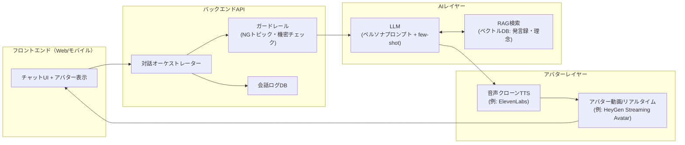

# AI社長アプリ 構築計画書

社長の口調・言い回し・価値観・判断基準を再現し、アバター（顔・声）付きで対話できる「AI社長」アプリを構築するための計画書。

---

## 1. 目的とユースケース

### 目的
- 社長の考え方・経営理念を、いつでも・誰でも引き出せる形にする（理念浸透・ナレッジ継承）
- 「社長に直接は聞きづらい」質問や提案の壁打ち相手を提供し、社内の風通しを良くする
- 社長の時間を奪わずに「社長ならどう考えるか」を全社員が参照できるようにする

### 想定ユースケース
| ユースケース | 利用者 | 例 |
|---|---|---|
| 質問・相談 | 全社員 | 「この案件、値引きすべきですか？」 |
| 壁打ち・提案の事前レビュー | 企画・営業 | 「この企画書、社長ならどこを突っ込む？」 |
| 理念・行動指針の解説 | 新入社員 | 「うちの会社が一番大事にしていることは？」 |
| 意思決定のシミュレーション | 管理職 | 「社長ならこの2案のどちらを選ぶ？」 |
| 朝礼・研修コンテンツ | 人事 | アバター動画でのメッセージ配信 |

---

## 2. 事例リサーチ

国内では「社長AI / AIクローン社長」は既に実用段階にあり、複数の導入事例が公開されている。

### 2.1 国内事例

| 事例 | 概要 | 学べるポイント |
|---|---|---|
| **ノジマ「Bunshin（分身）」** | 野島社長の経営理念・人生哲学を学習した社内向け生成AI。人材育成・社内コミュニケーションに活用 | 「理念の浸透」を主目的に据えると社内導入の合意が得やすい |
| **三井住友FG「AI-CEO」** | グループCEOの過去の発言・考え方を学習。GPT-4oベースのチャットボット + Microsoft技術のAIアバター | 大手もチャット+アバターの2層構成。既存LLM+RAGで実現している |
| **悟空のきもち「クローン社長」** | AIが考案した約1,000問に社長が音声で回答し、回答内容に加え語尾・口癖まで学習。社員が匿名で相談・壁打ちに利用 | **「AIが質問を作り→社長が音声で答える」収録方式が口調再現に最も効く**。開始1週間で700件超の相談が集まった事例あり |
| **リコー × 株式会社久永** | 経営者本人をモデリングした3Dデジタルクローンを作成。将来的にAIと連携し社員・顧客と対話するエージェントへ | アバター（見た目）とAI（頭脳）は分離して段階的に構築できる |
| **AIF（引退会長のAIクローン）** | 過去20年以上の従業員向け講話記録・著書・講演音声を学習。約2ヶ月で一問一答レベルに到達 | 既存の講話・著書アーカイブだけでも実用レベルに達する |
| **GIC「AIクローン社長」** | 音声+動画アバター型の商用サービス | 顔・声の学習を含む制作は外部サービス活用が現実的 |

### 2.2 事例から得られる共通パターン

1. **データの二本柱**：「思想・判断基準（何を言うか）」と「口調・口癖（どう言うか）」を分けて収集している
2. **Q&A収録が近道**：既存文書だけでなく、質問リストへの音声回答収録で精度が大きく上がる
3. **段階構築**：チャット → 音声 → アバターの順で拡張するのが定石
4. **主目的は社内向け**：理念浸透・相談・壁打ちが中心。対外利用は法的リスクが上がるため後回し
5. **費用感**：顔・声のデジタル分身の初期制作は数十万円規模から。フルスクラッチの本格導入はデータ収集数週間+学習調整1〜2ヶ月が相場

### 2.3 技術面の事例（口調再現の手法）

学術・技術コミュニティでの知見：

- **RAG**：事実・知識（社長の考え、過去の判断）の再現に強いが、口調・人格の再現はできない
- **プロンプト（ペルソナ設定 + few-shot実例）**：手軽で効果が高いが、長い会話でキャラが薄れる・ベースLLMの癖（一人称や語尾がズレる等）が出る課題がある
- **ファインチューニング**：口調・語尾・応答スタイルをモデル重みに焼き込める唯一の方法。ただしデータ量（数百〜数千対話）と運用コストが必要
- **実務上のベストプラクティス**：「知識はRAG、口調はプロンプト+実例、それでも足りなければファインチューニング」という段階的ハイブリッドが主流

---

## 3. 収集すべきデータ・情報（最重要セクション）

「何を言うか（思想）」「どう言うか（口調）」「どう見えるか・聞こえるか（アバター）」の3系統で収集する。

### 3.1 思想・知識データ（What：RAGの知識ベースになる）

| データ | 入手元 | 用途 | 優先度 |
|---|---|---|---|
| 経営理念・ミッション・行動指針 | 社内資料、Webサイト | 回答の価値観の軸 | ★★★ |
| 全社会議・朝礼のスピーチ（動画/音声/議事録） | 録画アーカイブ | 考え方・判断基準 | ★★★ |
| 社内報・社長ブログ・社長メッセージ | イントラ、メール | 考え方+文体の両方 | ★★★ |
| 過去の意思決定事例（背景→判断→理由） | 経営会議資料、本人ヒアリング | 「社長ならどうする」の再現 | ★★★ |
| インタビュー記事・講演・登壇資料 | 社外メディア、YouTube | 公開されている思想 | ★★☆ |
| 著書・寄稿 | あれば | 体系化された思想 | ★★☆ |
| 会社の基本情報（沿革、事業、組織、制度） | 社内資料 | 回答の前提知識 | ★★☆ |
| よくある質問と社長の模範回答 | 本人作成・監修 | 頻出質問の精度担保 | ★★★ |

### 3.2 口調・人格データ（How：スタイル再現の教師データになる）

| データ | 収集方法 | 抽出するもの |
|---|---|---|
| **Q&A音声収録（最重要）** | AIが質問リスト（300〜1,000問）を生成 → 社長が隙間時間に音声で回答 → 文字起こし | 語尾、口癖、一人称、話の展開パターン、褒め方・叱り方 |
| チャット・メールの実文面 | 本人同意の上で抜粋 | 書き言葉の文体、絵文字・記号の使い方 |
| 会議での発言録 | 文字起こし | 話し言葉の文体、質問の切り返し方 |
| 口調スタイルガイド（人手作成） | 秘書・側近へのヒアリング | 「〜だね」「まずは結論から」等の明文化されたルール、NGワード |
| 対話ペアデータ | 上記から「質問→社長の回答」形式に整形 | few-shot例・ファインチューニング用データセット |

**Q&A収録の質問カテゴリ例**：経営判断／人材・評価／顧客対応／失敗談・価値観／プライベートな雑談（人間味のため）／会社の歴史

### 3.3 アバター用データ（見た目・声）

| データ | 要件 | 用途 |
|---|---|---|
| 顔映像（学習用動画） | 明るい場所で正面、2〜5分程度の発話映像 | アバター（デジタルツイン）生成 |
| 音声サンプル | クリーンな環境で数分〜30分（品質重視なら長め） | 音声クローン（TTS） |
| 写真 | 高解像度の正面写真数枚 | 静止画ベースの簡易アバターの場合 |

### 3.4 データ整備のルール

- すべてのデータについて**社長本人の書面同意**を取得（肖像・音声・文章の利用範囲を明記）
- 機密情報・個人情報（人事評価、未公開の経営情報等）は知識ベースに入れる前に**必ずフィルタリング**
- データには出典・日付のメタデータを付与（考え方が変わった場合に古い発言を除外できるように）

---

## 4. システムアーキテクチャ

### 処理フロー
1. ユーザーが質問を入力（テキスト or 音声）
2. ガードレールで入力チェック（機密・不適切トピック）
3. RAGで社長の過去発言・理念から関連情報を検索
4. LLMが「ペルソナプロンプト + 口調のfew-shot実例 + RAG結果」で社長らしい回答を生成
5. 出力ガードレール（断定してはいけない話題＝人事・法務等は「本人に確認して」と返すルール）
6. 音声クローンTTSで社長の声に変換 → アバターがリップシンクして発話
7. 会話ログを保存（精度改善・本人レビュー用）

### 口調再現の戦略（段階的ハイブリッド）

| 段階 | 手法 | 内容 |
|---|---|---|
| Step 1 | システムプロンプト | 口調スタイルガイド（一人称・語尾・口癖・NGワード・話の組み立て方）を明文化して埋め込む |
| Step 2 | few-shot実例 | 実際の「質問→社長回答」ペアを5〜10件プロンプトに含める |
| Step 3 | RAG | 知識・過去の判断はベクトルDBから都度検索して注入 |
| Step 4（必要時） | ファインチューニング | Step1-3で口調が安定しない場合、対話ペア数百〜数千件でSFT |

---

## 5. 技術スタック案

| レイヤー | 第一候補 | 代替 | 備考 |
|---|---|---|---|
| LLM | Claude API（日本語の文体再現に強い） | GPT系, ローカルLLM | ファインチューニングが必要になったらOSSモデル（Qwen等）のSFTも検討 |
| RAG/ベクトルDB | pgvector（PostgreSQL） | Pinecone, Qdrant | 社内データなので自己ホスト可能な構成を優先 |
| 音声クローンTTS | ElevenLabs（Professional Voice Clone） | CoeFont（国産）, Play.ht | 日本語品質と声の再現度で比較検証する |
| アバター | HeyGen（Digital Twin + Streaming Avatar API、リアルタイム720p対応） | D-ID, リコー等の国産サービス, VRM/Live2D自作 | HeyGenはElevenLabs音声の持ち込みに対応 |
| バックエンド | Node.js (TypeScript) / Python (FastAPI) | — | ストリーミング応答必須 |
| フロントエンド | Next.js + WebRTC/WebSocket | — | チャットUI + アバター埋め込み |
| 認証 | 社内SSO（Google Workspace / Entra ID） | — | 社内限定公開が前提 |
| ログ・分析 | PostgreSQL + 管理画面 | — | 本人レビューのフィードバックループ用 |

**コストを抑えた簡易構成（PoC向け）**：静止画1枚 + D-ID/HeyGenの動画生成API + ElevenLabs即時クローン（音声30秒〜2分でOK）で、まず「動いて喋る社長」を最小コストで体験できる。

---

## 6. 開発ロードマップ

### Phase 0：データ収集・整備（2〜4週間）
- [ ] 社長本人の同意取得（肖像・音声・文章の利用範囲の合意書）
- [ ] 既存データの棚卸し（会議録画、社内報、ブログ、インタビュー）
- [ ] 質問リスト300問の生成（AI生成 + 人事・秘書レビュー）
- [ ] 社長のQ&A音声収録（初回100問目標、隙間時間で継続）
- [ ] 口調スタイルガイドの作成（語尾・口癖・NGワードの明文化）
- [ ] 機密フィルタリングルールの策定

### Phase 1：テキストチャット版 MVP（2〜3週間）
- [ ] データの文字起こし・チャンク化・ベクトルDB構築
- [ ] ペルソナプロンプト + few-shot + RAG の対話パイプライン実装
- [ ] チャットUI（社内SSO付き）
- [ ] ガードレール実装（答えてはいけない話題の定義）
- [ ] **社長本人によるブラインドレビュー**（回答50件を本人が「自分らしいか」5段階評価）

### Phase 2：音声対応（1〜2週間）
- [ ] 音声サンプル収録（クリーン環境で30分推奨）
- [ ] ElevenLabs等で音声クローン作成、日本語品質を本人・社員で評価
- [ ] チャット回答の音声再生機能

### Phase 3：アバター対応（2〜4週間）
- [ ] アバター学習用動画の撮影（正面・2〜5分）
- [ ] HeyGen Digital Twin等でアバター生成
- [ ] リアルタイム対話（Streaming Avatar API）または生成動画方式の実装
- [ ] レイテンシ・コストの計測（リアルタイムは従量課金が高めのため利用シーンを限定する判断も）

### Phase 4：社内展開・運用（継続）
- [ ] パイロット部署で限定公開 → フィードバック収集
- [ ] 会話ログの定期レビュー（「社長らしくない回答」を本人が添削 → few-shot/データに反映）
- [ ] 回答精度が頭打ちならファインチューニング検討
- [ ] 利用ガイドライン配布（「AIの回答は参考。最終判断は本人へ」の明記）

---

## 7. 評価方法

| 評価軸 | 方法 | 合格基準の例 |
|---|---|---|
| 口調の再現度 | 本人+側近によるブラインドテスト（AI回答と本人回答を混ぜて判別） | 判別率が70%を下回る（=見分けがつきにくい） |
| 思想の正確性 | 本人による回答レビュー | 「自分の考えと違う」回答が10%未満 |
| 安全性 | NGトピックへの応答テスト | 機密・人事・法務系で100%回避 |
| 利用価値 | 社員アンケート・利用件数 | 週次アクティブ利用、相談件数の推移 |

---

## 8. リスク・倫理・法務上の注意

| リスク | 対策 |
|---|---|
| **なりすまし・悪用**（音声・アバターの流出によるディープフェイク悪用） | 社内限定公開・SSO必須。音声/アバターのAPIキー厳重管理。生成物への透かし・「AIである」ことの常時明示 |
| **肖像権・パブリシティ権** | 本人の書面同意（利用範囲・期間・退任時の扱いを明記）。対外利用は別途合意 |
| **本人の意思との乖離**（AIが本人の考えと違うことを言う） | 「これはAIによる再現であり本人の発言ではない」と全画面に明示。重要判断は「本人に確認を」と返すガードレール。本人による定期レビュー |
| **機密情報の漏洩** | 学習・RAGデータ投入前の機密フィルタリング。外部APIへ送るデータの範囲を規程化 |
| **回答の責任問題**（AI回答を根拠に業務判断してしまう） | 利用ガイドラインで「参考情報」であることを明記。人事・法務・報酬に関する質問は回答拒否 |
| **退任・交代時の扱い** | データとクローンの削除・停止条件を事前に合意 |

---

## 9. 概算費用感（参考）

| 項目 | 目安 |
|---|---|
| 顔・声のデジタル分身 初期制作（外部サービス利用） | 数万〜30万円程度 |
| ElevenLabs（音声クローン+TTS） | 月額数十〜数百ドル（利用量次第） |
| HeyGen（アバターAPI） | 月額数十ドル〜、リアルタイムStreaming利用は従量課金 |
| LLM API | 利用量次第（社内数百人規模なら月数万円程度から） |
| 開発工数 | Phase 1-3で延べ2〜3ヶ月（1〜2名） |

---

## 10. 次のアクション

1. **社長への企画説明と同意取得**（この計画書を提示）
2. 既存データの棚卸しリスト作成
3. 質問リスト300問のドラフト生成
4. Phase 1 MVP のリポジトリ雛形作成（Next.js + API + ベクトルDB）

---

## 参考資料（リサーチ出典）

### 国内事例
- [AIで社長の分身を作成!? “社長クローンチャット”はどこまで現場で使えるのか（マイナビ）](https://tenshoku.mynavi.jp/engineer/guide/articles/ZcHsCBIAACQAwr-5)
- [「社長AI」と話そう、開始1週間で700件超の相談（月刊総務オンライン）](https://www.g-soumu.com/articles/ae5146ba-05d0-4f82-8adb-33bf95bc3caf)
- [リコー、企業経営者のデジタルクローンを提供開始](https://jp.ricoh.com/release/2025/0411_1)
- [久永社長の3Dデジタルクローンを作成（株式会社久永）](https://kk-hisanaga.co.jp/news/20250411/)
- [引退する会長が『AIクローン』導入 理念やノウハウを継承（カンテレ）](https://www.ktv.jp/news/feature/240625-ai/)
- [【AI経営の最前線】AI役員・社長AIとは？導入事例（WEEL）](https://weel.co.jp/media/ai-board-member/)
- [AIクローン社長（音声＋動画アバター）- GIC](https://gicjp.com/ai_clone)
- [社長AIクローン開発会社のおすすめ5選（AI活用研究所）](https://www.aidma-hd.jp/ai/ai-syatyoclone-kaihatsu-osusume/)
- [社長のAIクローン費用相場（DataEgg）](https://dataegg.co.jp/ai/602/)
- [生成AIで「社長のクローン」を誕生させる（PRESIDENT Online ACADEMY）](https://academy.president.jp/articles/-/1338)

### 口調・人格再現の技術
- [キャラクターを設定したLLM対話生成におけるfine-tuneおよびfew shot promptの効果（JSAI 2024）](https://www.jstage.jst.go.jp/article/pjsai/JSAI2024/0/JSAI2024_3Xin208/_article/-char/ja/)
- [Character-LLM構築のためのキャラクター設定指示（NLP 2024）](https://www.anlp.jp/proceedings/annual_meeting/2024/pdf_dir/P5-9.pdf)
- [個人の話し方・性格・思考を再現するアバターの作り方](https://medical-science-labo.jp/llm30/)
- [LLMキャラ付けファインチューニング：プロンプトエンジニアリングとの比較](https://note.com/sharp_engineer/n/ne9c667a01d0e)
- [キャラクター付けを目的としたファインチューニング（IIJ Engineers Blog）](https://eng-blog.iij.ad.jp/archives/28110)

### アバター・音声技術
- [HeyGen Developers - AI Video API](https://developers.heygen.com/)
- [HeyGen + ElevenLabs 音声連携](https://help.heygen.com/en/articles/8310663-how-to-integrate-elevenlabs-other-third-party-voices)
- [ElevenLabs と HeyGen の音声クローン比較（2026）](https://www.aitoolssme.com/blogs/elevenlabs-heygen-ai-voice-cloning)
- [HeyGen Avatar IV + ElevenLabs でのAIキャラクター作成](https://elevenlabs.io/blog/how-to-create-ai-characters-with-heygen-avatar-iv-and-elevenlabs-voice-changer)

### 倫理・法務
- [AIデジタルクローン技術と倫理問題](https://dreaman.co.jp/ai-digital-clone-ethics/)
- [AIキャラクターは「肖像権侵害」となり得るか（弁護士解説）](https://kai-law.jp/intellectual-property-right/portrait-rights-of-ai-characters/)
- [生成AI時代における肖像権・パブリシティ権の侵害疑義事案の実態調査](https://www.ip-fw.com/4465317)
